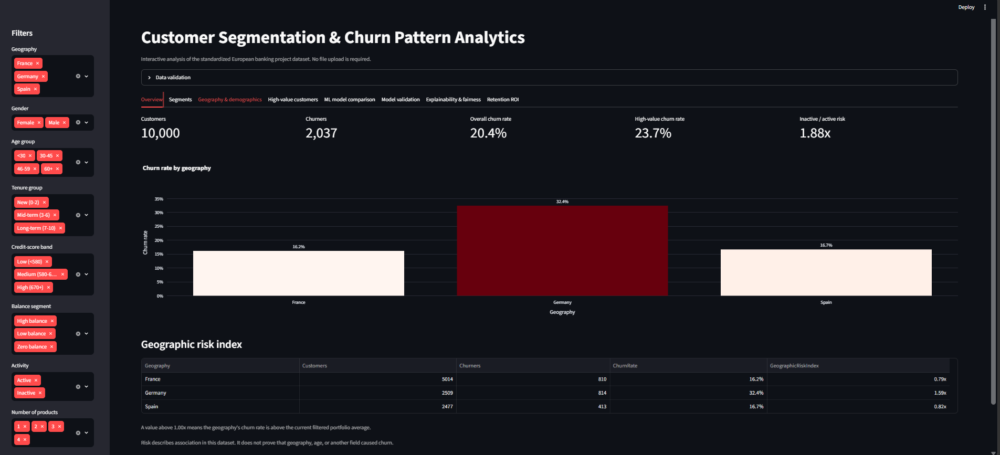
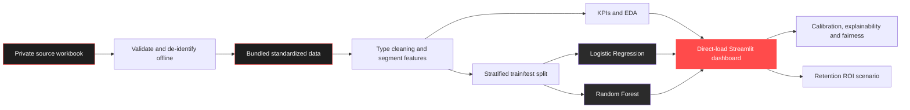

# European Bank Customer Segmentation & Churn Analytics

[](https://github.com/iqra-insights/churnsight-eu-banking/actions/workflows/ci.yml)
[](https://www.python.org/)
[](https://churnsight-eu-banking.streamlit.app)
[](LICENSE)

An end-to-end portfolio project for validating customer data, creating business-defined
segments, measuring churn patterns, comparing classification models, and presenting the
results in an interactive Streamlit dashboard.

**Live demo:** [churnsight-eu-banking.streamlit.app](https://churnsight-eu-banking.streamlit.app)
*(deploy via Streamlit Community Cloud — see Quick start below if the link is not yet live)*

> The public application automatically loads a standardized, de-identified copy of the supplied
> project dataset. Original customer IDs and surnames are not published. The source workbook does
> not contain authoritative provenance proving that it came from the European Central Bank, so
> this project describes it as an educational European banking dataset.

## Dashboard preview



*Overview tab — live filters for geography, gender, age, tenure, credit-score band, balance
segment, activity, and product count on the left; overall KPIs, a churn-by-geography chart, and
a geographic risk index table on the right. Seven more tabs (Segments, Geography & demographics,
High-value customers, ML model comparison, Model validation, Explainability & fairness, Retention
ROI) provide deeper drill-down views.*

## Business questions

1. What is the overall customer churn rate?
2. Which geographic, demographic, tenure, engagement, credit, and balance segments have the
   highest churn rate and churn contribution?
3. Is churn concentrated among high-balance customers?
4. How do an explainable Logistic Regression baseline and a nonlinear Random Forest compare?
5. Are model results stable, calibrated, and consistent across customer groups?
6. What could a capacity-constrained retention campaign deliver under explicit assumptions?

## Product capabilities

- Validates schema, missing values, duplicates, numeric types, binary fields, and unusual ranges.
- Creates non-overlapping age, credit-score, tenure, balance, activity, and churn segments.
- Updates KPIs and charts from geography, gender, and age filters.
- Provides segment drill-down tables and CSV downloads.
- Explores geography × age interactions and high-value balance exposure.
- Filters by geography, gender, age, tenure, credit, balance, activity, and product count.
- Compares estimated salary and balance visually for high-value churn analysis.
- Compares Logistic Regression and Random Forest using ROC-AUC, PR-AUC, recall, precision,
  F1, accuracy, and a confusion matrix.
- Allows the Random Forest decision threshold to be adjusted for campaign capacity.
- Adds five-fold stratified validation with mean and standard deviation for key metrics.
- Compares predicted probabilities with observed churn using calibration curves and Brier score.
- Uses holdout permutation importance plus signed Logistic Regression coefficients.
- Provides customer-level explanations using generated dashboard IDs.
- Audits precision, recall, false-positive rate, and false-negative rate by customer group.
- Simulates campaign cost, expected retained customers, protected value, net benefit, and ROI.
- Opens the complete dashboard immediately; visitors do not need to upload a file.

## Verified analytical highlights

Using the supplied 10,000-row workbook and the documented segment rules:

| Measure | Result |
|---|---:|
| Overall churn | 20.37% |
| Germany churn | 32.44% |
| France churn | 16.15% |
| Spain churn | 16.67% |
| Inactive/active churn-risk ratio | 1.88× |
| High-value threshold (75th percentile) | 127,644.24 |
| High-value churn | 23.68% |

These values are descriptive associations, not causal effects. `Balance at risk` is an exposure
proxy, not recognized revenue loss.

### Verified model robustness

| Model | Five-fold ROC-AUC | Five-fold PR-AUC | Holdout Brier score |
|---|---:|---:|---:|
| Logistic Regression | 0.769 ± 0.016 | 0.460 ± 0.031 | 0.194 |
| Random Forest | 0.861 ± 0.008 | 0.680 ± 0.019 | 0.129 |

Five-fold values are mean ± standard deviation. Brier score is probability error, where lower is
better, but it must be interpreted together with the calibration curve and ranking metrics.

## Repository structure

```text
.
├── .github/                 # CI workflow, issue and pull-request templates
├── .streamlit/               # Locked dark theme (config.toml) so the app looks the same for
│                            #   every viewer, regardless of their own Streamlit settings
├── data/                    # Local data folders (created automatically); only the de-identified
│                            #   dashboard asset is tracked in git — see Quick start below
├── docs/                    # Architecture, dictionary, methodology, model card, and screenshots
├── european_bank_churn/     # Reusable production Python package
│   ├── analytics.py         # KPI and segment calculations
│   ├── business.py          # Transparent retention scenario calculations
│   ├── config.py            # Schema, band definitions, and model settings
│   ├── dashboard.py         # Streamlit page composition
│   ├── data.py              # Ingestion, validation, and feature engineering
│   ├── modeling.py          # Logistic Regression and Random Forest pipelines
│   └── visualization.py     # Plotly chart builders
├── models/                  # Local model artifacts (created automatically); gitignored
├── notebooks/               # Numbered exploration notebooks and guidance
├── reports/                 # Research paper, executive summary, EDA report, and slide deck
├── scripts/                 # Reproducible report-generation commands
├── tests/                   # Synthetic unit and integration tests
├── app.py                   # Thin Streamlit Cloud entrypoint
├── LICENSE                  # MIT License
├── Makefile                 # Common local commands
├── pyproject.toml           # Package and quality-tool configuration
├── requirements.txt         # Streamlit/runtime dependencies
└── smoke_test.py            # End-to-end check against a local workbook
```

This structure is intentionally based on the separation encouraged by
[Cookiecutter Data Science](https://github.com/drivendataorg/cookiecutter-data-science), while
remaining small enough for a beginner to understand.

## Quick start

**At a glance** (Windows/Anaconda — see the detailed steps below for other platforms):

```powershell
cd churnsight-eu-banking
pip install -r requirements.txt -r requirements-dev.txt
streamlit run app.py
```

That's all that's needed to see the dashboard — it loads the bundled, de-identified dataset
automatically. The steps below cover the raw workbook, tests, and asset rebuilds in detail.

### 1. Get the code

Clone with git:

```bash
git clone https://github.com/iqra-insights/churnsight-eu-banking.git
cd churnsight-eu-banking
```

Or download the repository as a ZIP from GitHub (**Code → Download ZIP**), then extract it and
`cd` into the extracted folder.

### 2. Create an environment and install dependencies

Using a virtual environment (macOS/Linux):

```bash
python3.11 -m venv .venv
source .venv/bin/activate
python -m pip install --upgrade pip
python -m pip install -r requirements.txt
```

Windows PowerShell:

```powershell
python -m venv .venv
.venv\Scripts\Activate.ps1
python -m pip install --upgrade pip
python -m pip install -r requirements.txt
```

Using an existing Anaconda/Miniconda installation (no virtual environment needed):

```bash
pip install -r requirements.txt
```

### 3. Add the raw workbook (for the notebook and smoke test only)

The Streamlit dashboard works immediately with the bundled, de-identified
`data/processed/european_bank_dashboard.csv.gz` asset — **no raw file is required to run the
app.** The raw workbook is only needed if you want to re-run the notebook or the smoke test
against the original data.

If you have the source workbook, create the folder and place it there — this path is
intentionally excluded from git (see Security below):

```bash
mkdir -p data/raw
# copy your European_Bank.xlsx into data/raw/ now
python smoke_test.py "data/raw/European_Bank.xlsx"
```

A successful run prints `Smoke test passed.` along with the row count and churn rate.

### 4. Run the dashboard

```bash
streamlit run app.py
```

This opens the dashboard in your browser at `http://localhost:8501`. Press `Ctrl+C` in the
terminal to stop it.

### 5. Run the automated tests (optional, verifies everything end to end)

```bash
python -m pip install -r requirements-dev.txt
python -m ruff check .
python -m pytest --cov=european_bank_churn
```

### 6. Rebuild derived assets from the raw workbook (optional)

To rebuild the public, de-identified dashboard asset from an authorized source workbook:

```bash
python scripts/build_dashboard_dataset.py "data/raw/European_Bank.xlsx"
```

The build replaces every original `CustomerId` with a generated `DEMO-xxxxx` record ID and every
surname with `Anonymous`, then verifies the row count and churn target before writing the compressed
asset. Never commit the private source workbook.

To regenerate the full Markdown EDA report from the workbook:

```bash
python scripts/generate_eda_report.py "data/raw/European_Bank.xlsx"
```

### Common issues

| Symptom | Fix |
|---|---|
| `FileNotFoundError: ...data\raw\European_Bank.xlsx` | The raw workbook is not tracked in git by design. Create `data/raw/` yourself and place the file there — see step 3. |
| `streamlit: command not found` | Run `pip install -r requirements.txt` first, and make sure you're running commands from inside the project folder. |
| Path has spaces or `(1)` in it (e.g. a re-downloaded ZIP) | Wrap the path in double quotes when running commands, e.g. `cd "C:\Users\You\Downloads\churnsight-eu-banking (1)"`. |
| Dashboard opens but shows no charts | Confirm `data/processed/european_bank_dashboard.csv.gz` exists — it ships with the repository and should not be deleted or gitignored. |

## Method summary



See [docs/architecture.md](docs/architecture.md) for the full component map and deployment contract.

The required project is primarily segmentation and descriptive analytics. ML is a secondary
component used to rank churn risk, not a replacement for business KPI analysis.

## Notebook workflow

Notebooks are for exploration and communication, not the only home for reusable logic — import
validation, segmentation, KPI, and modeling functions from `european_bank_churn/` instead of
duplicating them in a cell.

Recommended naming convention:

1. `01_data_quality_and_eda.ipynb`
2. `02_segmentation_and_kpis.ipynb`
3. `03_model_comparison.ipynb`

Keep notebook outputs small, restart the kernel before committing, and verify that no
customer-level rows, absolute local paths, credentials, or hidden metadata are published. Promote
stable code from notebooks into the package and cover it with tests.

Example first cell:

```python
from pathlib import Path

from european_bank_churn import load_excel, prepare_data, validate_dataset

workbook = Path("../data/raw/European_Bank.xlsx")
raw = load_excel(workbook)
validate_dataset(raw)
data, thresholds = prepare_data(raw)
```

## Documentation and deliverables

- [Architecture](docs/architecture.md)
- [Beginner implementation guide](docs/implementation_guide.md)
- [Data dictionary](docs/data_dictionary.md)
- [Analytical methodology and KPI formulas](docs/methodology.md)
- [Model card and responsible-use limits](docs/model_card.md)
- [Research paper](reports/research_paper.md)
- [Presentation deck](reports/ChurnSight_Presentation.pptx)
- [Exploratory data analysis report](reports/eda_report.md)
- [Executive summary for public-sector stakeholders](reports/executive_summary.md)
- [Contribution guide](CONTRIBUTING.md)
- [Security and data-reporting policy](SECURITY.md)

## Reproducibility and automation

- Segment thresholds and model settings are centralized in `config.py`.
- The public dashboard data can be rebuilt deterministically with
  `scripts/build_dashboard_dataset.py`.
- The split is stratified and controlled by `random_state=42`.
- Five-fold stratified validation reports both average performance and variability.
- Model metadata includes a semantic model version and dataset fingerprint.
- Preprocessing and classifiers use scikit-learn `Pipeline` objects to reduce leakage risk.
- Tests use synthetic records and verify KPI denominators, boundaries, model output, calibration,
  subgroup metrics, explanations, and ROI formulas.
- GitHub Actions runs linting, tests, coverage, and compilation on Python 3.11 and 3.12.

## Responsible use

This is an educational decision-support project, not a production banking decision system.
Do not use its scores to deny services or make adverse decisions. Before operational use, obtain
data-owner approval and complete privacy, fairness, calibration, drift, security, and causal-impact
reviews. Gender and geography analysis must be interpreted as association and audited for fairness.

## License

This project is licensed under the [MIT License](LICENSE). You are free to use, copy, modify,
and distribute this software, including for commercial purposes, provided the original copyright
and license notice are included. See the `LICENSE` file for the full text.
