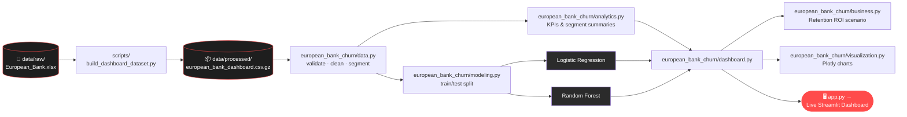

# Project architecture

## Design goal

Keep the Streamlit page easy to deploy while making analytical logic reusable, testable, and
independent from the user interface.

## 🏗️ Architecture & Data Flow

The raw workbook never ships publicly — only a maintainer with the authorized source file runs
`build_dashboard_dataset.py`, and only its de-identified, compressed output is committed to the
repository. `app.py` stays a thin entrypoint: every calculation the dashboard shows is produced by
a tested function in `european_bank_churn/`, not written inline on the page.

## Component map

| Component | Responsibility | Must not contain |
|---|---|---|
| `app.py` | Streamlit Cloud entrypoint | Business rules or model code |
| `dashboard.py` | Page layout, widgets, and session state | Hard-coded KPI calculations |
| `data.py` | Excel/CSV ingestion, de-identification, validation, cleaning, segments | Streamlit widgets |
| `analytics.py` | KPI denominators and grouped summaries | File or UI operations |
| `modeling.py` | Splits, pipelines, validation, calibration, explanations, subgroup metrics | Customer identifiers as features |
| `business.py` | Capacity-based retention scenario and ROI formulas | Claims of actual revenue impact |
| `visualization.py` | Plotly figure construction | Data cleaning or model fitting |
| `tests/` | Synthetic verification of analytical contracts | Real customer records |

## Data flow

1. A maintainer runs `scripts/build_dashboard_dataset.py` against the authorized private workbook.
2. The script validates the source and replaces original IDs and surnames.
3. The compressed standardized dataset is bundled with the application.
4. `load_dashboard_data` loads it automatically when Streamlit starts.
5. `validate_dataset` reports errors and warnings without silently changing rows.
6. `prepare_data` converts numeric fields, keeps valid binary targets, and creates segments.
7. `analytics.py` calculates KPIs on the current filtered population.
8. If requested, `modeling.py` creates one stratified holdout split and fits two pipelines.
9. Advanced validation adds five stratified folds, calibration, permutation importance, local
   Logistic Regression contributions, and subgroup error-rate comparisons.
10. `business.py` ranks held-out customers and applies only user-entered campaign assumptions.
11. The dashboard renders summaries and model diagnostics without asking visitors for a file.

## Why a thin entrypoint matters

Streamlit Community Cloud expects `app.py`, but tests and notebooks should not import a large page
script with immediate UI side effects. Keeping the page implementation inside a package allows the
same analytics functions to be used by tests, notebooks, future APIs, or scheduled jobs.

## Deployment contract

- Python: 3.11 or 3.12.
- Entrypoint: `app.py`.
- Runtime dependencies: `requirements.txt`.
- No secret is required.
- Model version: `1.1.0`; each run also records a dataset fingerprint and random seed.
- The de-identified compressed dashboard dataset is committed; the source workbook and serialized
  models are not.
